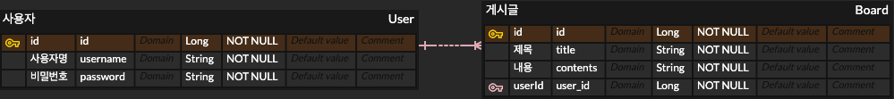

# Spring으로 만들어보는 게시판 프로젝트

### 1. 기능 정의
#### <회원가입 & 로그인>
1. 회원가입
    - Client에서 username, password 입력
    - username, password 유효성 검사
      - username : 4 ~ 10자리, [a-z0-9]
      - password : 8 ~ 15자리, [a-zA-Z-0-9] + 특수문자
    - username 중복 확인
    - 유효성 검사, 중복 확인 통과하면, 회원 저장 후 Client로 성공 메시지, 상태코드 반환
    - 회원 권한 부여(ADMIN, USER) - ADMIN 회원은 모든 게시글, 댓글 수정 / 삭제 가능
2. 로그인
    - Client에서 username, password 입력
    - DB에서 회원 username, password 확인
    - 해당 회원 정보 있는 경우, 유저 정보와 JWT 활용하여 토큰 발급 후 발급한 토큰 Header 추가하고 성공 메시지, 상태코드 반환
---
#### <게시글>
1. 전체 게시글 목록 조회
    - 제목, 작성자명(username), 작성 내용, 작성 날짜를 조회
    - 각각의 게시글에 등록된 모든 댓글을 게시글과 같이 Client에 반환
    - 게시글, 댓글 모두 작성 날짜 기준 내림차순으로 정렬
    - 게시글, 댓글 '좋아요' 개수 함께 반환
2. 게시글 작성
    - Spring Security를 사용하여 토큰 검사 및 인증
    - 제목, 작성자명, 비밀번호, 작성 내용 저장
    - 저장된 게시글을 Client 로 반환
3. 선택한 게시글 조회
    - 선택한 게시글의 제목, 작성자명(username), 작성 날짜, 작성 내용을 조회
    - 선택한 게시글에 등록된 모든 댓글을 선택한 게시글과 같이 Client에 반환
    - 댓글은 작성 날짜 기준 내림차순으로 정렬
    - 게시글, 댓글 '좋아요' 개수 함께 반환
4. 선택한 게시글 수정
    - Spring Security를 사용하여 토큰 검사 및 인증
    - 제목, 작성자명, 작성 내용을 수정 후, 수정된 게시글 Client 로 반환
    - 게시글 '좋아요' 개수도 함께 반환
5. 선택한 게시글 삭제
    - Spring Security를 사용하여 토큰 검사 및 인증
    - 선택한 게시글을 삭제 후, Client 로 성공 메시지, 상태코드 반환
---
#### <댓글>
1. 댓글 작성
   - 토큰 검사 후, 유효한 토큰일 경우에만 댓글 작성
   - 선택한 게시글이 DB에 있는지 확인 후, 있다면 댓글 등록
   - Client에 등록된 댓글 반환
2. 댓글 수정
    - 토큰 검사 후, 유효한 토큰이면서 해당 사용자가 작성한 댓글만 수정
    - 선택한 댓글이 DB에 있는지 확인 후, 있다면 댓글 수정
    - Client에 수정된 댓글 반환
    - 댓글에 '좋아요' 개수도 함께 반환
3. 댓글 삭제
    - 토큰 검사 후, 유효한 토큰이면서 해당 사용자가 작성한 댓글만 삭제
    - 선택한 댓글이 DB에 있는지 확인하고, 있다면 댓글 삭제
    - Client로 성공 메시지, 상태코드 반환
---
#### <좋아요>
1. 게시글 좋아요
   - 선택한 게시글에 '좋아요'를 할 수 있다.
   - 사용자가 이미 '좋아요'한 게시글에 다시 '좋아요' 요청을 하면 취소된다.
   - Client로 성공 메시지, 상태코드 반환
2. 댓글 좋아요
   - 선택한 댓글에 '좋아요'를 할 수 있다.
   - 사용자가 이미 '좋아요'한 댓글에 다시 '좋아요' 요청을 하면 취소된다.
   - Client로 성공 메시지, 상태코드 반환
---
#### <예외처리>
다음의 경우에 에러메시지와 statusCode: 400을 Client에 반환한다.
* 토큰이 필요한 API 요청에서 토큰을 전달하지 않았거나, 정상 토큰이 아닌 경우 -> "토큰이 유효하지 않습니다."
* 유효한 토큰이지만, 해당 사용자가 작성한 게시글/댓글이 아닌 경우 -> "작성자만 삭제/수정할 수 있습니다."
* DB에 이미 존재하는 username으로 회원가입 요청한 경우 -> "중복된 username 입니다."
* 로그인 시, username, password 정보가 맞지 않는 경우 -> "회원을 찾을 수 없습니다."
* 회원가입 시 username 구성이 알맞지 않는 경우 -> "아이디는 4~10자리 영문 소문자(a~z),숫자(0~9)를 사용하세요!"
* 회원가입 시 password 구성이 알맞지 않는 경우 -> "비밀번호는 8~15자리 영문 대소문자(a~z, A~Z), 숫자(0~9), 특수문자를 사용하세요!"
---
### 2. 유스케이스 다이어그램

### 3. ERD

### 4. API 명세서
[[api 명세서 보기]](https://docs.google.com/spreadsheets/d/12nQxuAr3CpparDpRhQVlwDC4lZY4YiESREh6aZNFuOE/edit?usp=sharing)

 

> ❓ Why : 질문과 답변

1. **수정, 삭제 API의 request를 어떤 방식으로 사용하셨나요? (param, query, body)**
   - **param**, **body** 방식을 사용하였다.
   - 수정, 삭제 모두 대상 게시글의 id를 받아야 하므로 서버에서 `@PathVariable`로 id를 받도록 **param** 방식을 사용하였다.
   - 수정할 때는 수정할 내용 { `title`, `contents`, `author`, `passwrod` } 를 받아야 하고, 삭제할 때는 { `password` } 를 받아야 하므로, 서버에서 `@RequestBody`로 데이터를 넘길 수 있도록 **body** 방식을 사용하였다.
2. **어떤 상황에 어떤 방식의 request를 써야하나요?**
   - **param**
      - 주소에서 포함된 변수를 받는다.
      - `/api/post/{id}`
      - `/api/post/id/{id}/name/{name}`
      - 식별할 데이터에 대한 정보를 받아올 때 적절하다.
         - `/books/123` → 123번 책 정보를 가져온다.
      - 서버에서 `@PathVariable` 로 받는다.
   - **query**
      - 엔드포인트에서 물음표(?) 뒤에 key=value 형태로 변수를 담는다.
      - `api/post?key=value&key2=value2`
      - 정렬이나 필터링이 필요한 경우 적절하다.
         - `/books?genre=novel` → 장르가 소설인 책 목록을 가져온다.
   - **body**
      - URL에는 보이지 않는 오브젝트 데이터(JSON, XML 등)를 담는다.
      - 객체를 바로 담아서 보낼 경우 적절하다.
3. **RESTful한 API를 설계했나요? 어떤 부분이 그런가요? 어떤 부분이 그렇지 않나요?**
   - `RESTful` : REST API 의 설계 의도를 명확하게 지킴으로써, 각 구성 요소들의 역할이 완벽하게 분리되어 있어, URI만 보더라도 리소스를 명확하게 인식할 수 있도록 표현한 설계 방식
      - 메서드 기능이나 뷰가 아닌, **리소스(데이터) 중심의 API를** 구성해야 한다.

        → 게시글이라는 `post` 리소스 중심으로 API를 설계하였다.

        → 메서드 기능은 http 메서드에서 미리 정의되어 있으므로, URI에는 대상이 되는 리소스(`post`)만 담도록 설계하였다.

4. **적절한 관심사 분리를 적용하였나요? (Controller, Repository, Service)**
   - `Controller` : URL 맵핑을 통해 특정 메서드가 호출되도록 한다.
      - http 메서드와 함께 특정 URL로 요청이 올 때, 특정 메서드가 실행되게 구현했다.
   - `Service` : 비지니스 로직을 수행한다.
      - 메서드의 기능을 직접 구현하며 repository에서 데이터를 가져오거나 저장한다.
   - `Repository` : 데이터베이스에 저장하고 조회하는 기능을 수행한다.
      - `JpaRepository` 를 상속받아 `Board` 엔티티를 DB에 저장하도록 구현했다.
5. **API 명세서 작성 가이드라인을 검색하여 직접 작성한 API 명세서와 비교해보세요!**
   - `기능`, `메서드`, `URL`, `Request`, `Response` 항목으로 작성했다.
