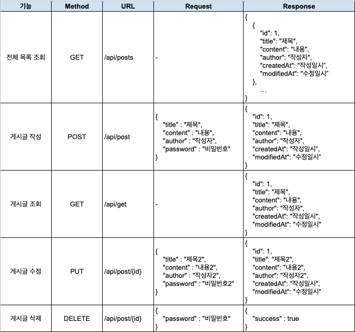

# Spring으로 만들어보는 게시판 프로젝트

### 1. 기능 정의
1. 전체 게시글 목록 조회
    - 제목, 작성자명, 작성 내용, 작성 날짜를 조회하기
    - 작성 날짜 기준 내림차순으로 정렬하기
2. 게시글 작성
    - 제목, 작성자명, 비밀번호, 작성 내용을 저장하고
    - 저장된 게시글을 Client 로 반환하기
3. 선택한 게시글 조회
    - 선택한 게시글의 제목, 작성자명, 작성 날짜, 작성 내용을 조회하기
4. 선택한 게시글 수정
    - 수정을 요청할 때 수정할 데이터와 비밀번호를 같이 보내서 서버에서 비밀번호 일치 여부를 확인 한 후
    - 제목, 작성자명, 작성 내용을 수정하고 수정된 게시글을 Client 로 반환하기
5. 선택한 게시글 삭제 API
    - 삭제를 요청할 때 비밀번호를 같이 보내서 서버에서 비밀번호 일치 여부를 확인 한 후
    - 선택한 게시글을 삭제하고 Client 로 성공했다는 표시 반환하기

### 2. 유스케이스 다이어그램

### 3. API 명세서

